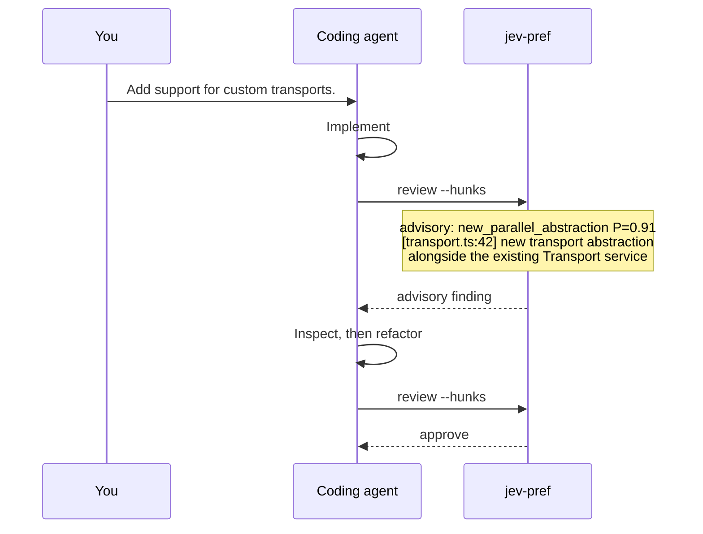

# jev-pref


**Turn your preferences from AGENTS.md into a fast, Jev-powered AI linter.**

`jev-pref` lets you define project-specific semantic rules, run them against
code changes with [Jev](https://docs.typesafe.ai), and feed the results back to
your coding agent.

## Quick start

Tell your coding agent:

```text
Run `npx jev-pref setup` and follow the instructions it prints.
```

That's it.

`setup` inspects the repository and teaches the agent how to configure
`jev-pref`. The agent explains the system, asks you a few questions, helps
translate your preferences into useful semantic checks, and adds persistent
instructions to `AGENTS.md`, `CLAUDE.md`, or wherever you choose.

No special agent integration or global installation is required. Node.js 20+
and `npx` are enough.

## What jev-pref is for

Think:

```text
TypeScript  → type invariants
ESLint      → syntax and static rules
tests       → behavioral invariants
jev-pref    → semantic project rules
```

Instead of asking an AI "is this code good?", you define what matters, Jev
classifies the evidence in the change, `jev-pref` maps the result to an
outcome, and your coding agent acts on it. The full boundary — what Jev may
and may not judge — lives in [docs/principles.md](./docs/principles.md).

Good questions name externally defined, evidence-grounded checks:

```text
Does this diff introduce new mutable module-level state?
```

```text
Does this change remove or rename an existing exported symbol?
```

```text
Classify the API impact:

- none
- additive
- behavioral
- breaking
```

Poor questions ask Jev to invent a standard of quality:

```text
Is this good architecture? Is this code clean? Are these tests sufficient?
```

If you cannot explain what visible evidence would make an answer true, the
rule needs more shaping before it becomes a check.

## What it looks like

A normal agent workflow looks like this:



`jev-pref` is the **linter**.

Your coding agent is the **fixer**.

## Setup

Run:

```bash
npx jev-pref setup
```

`setup` is intentionally agent-facing. It inspects your project, finds
existing guidance, and helps your coding agent turn suitable preferences into
concrete Jev checks — asking whether each result is blocking or advisory,
choosing shared vs local configuration, and installing your preferred
agent/CI integration. Credentials stay environment-only; the agent records
the variable name, never its value.

The artifacts it produces:

```text
AGENTS.md           # review + sync contract for your agent
jev-pref.json       # shared checks (committed)
.gitignore          # only if using gitignored jev-pref.local.json
```

## Writing good semantic checks

The rule of thumb ([principles](./docs/principles.md)): if you cannot explain
what visible evidence would make an answer true, the rule needs more shaping.

### Which guidance becomes a check

Classify each candidate before encoding it:

```text
DIRECT
The answer is externally defined and visible in the review input.

NEEDS SHAPING
The intent is useful, but its terms lack observable criteria.

NOT FOR JEV
The rule is procedural, needs unavailable evidence, asks for subjective
quality judgment, or deterministic tooling can enforce it better.
```

Only DIRECT candidates become Jev checks. For example, "public primitives
should compose with existing primitives rather than introduce parallel
systems" is too broad alone; shaped, it becomes "does this change introduce
a new public abstraction representing a concept already represented by the
project's Surface primitive?".

### Prefer concrete conditions

Instead of:

```text
Keep code simple.
```

define what unwanted complexity means in this project:

```text
Does this change introduce a new abstraction layer that only forwards calls
to one existing implementation without adding a policy boundary,
representation change, lifecycle boundary, or implementation choice?
```

Instead of:

```text
Don't break APIs.
```

use:

```text
Does this change remove, rename, or add required arguments to an existing
public export without preserving a compatible path?
```

Instead of `Use Effect idiomatically`, define and split the actual Effect
conventions the project follows.

### One judgment per check

Avoid combining properties that can disagree:

```text
Is this code simple, type-safe, composable, well-tested, and idiomatic?
```

A condition should usually represent one semantic predicate.

### Fixed classifications are powerful

Not every check needs to be yes/no. Jev can classify a change into fixed labels
defined by the project, and `jev-pref` can map those labels to consequences.

```text
Jev:      public API impact = behavioral, P=0.86, confidence=0.73
Policy:   behavioral → advisory
Result:   advisory
```

A condition is a Bernoulli question — Jev estimates p(true) and the
threshold decides; see [docs/evaluation-model.md](./docs/evaluation-model.md)
for confidence, cutoffs, and below-cutoff fallthrough. Each label description
must carry the observable criteria that set it apart from its neighbors (Jev
sees only those strings plus `guidance`); spell out non-obvious boundaries or
probability scatters and the top label falls below cutoff.

### Don't replace deterministic tooling

If existing tooling can enforce a rule reliably, use it:

```text
Prettier        → formatting
ESLint          → syntax and static patterns
TypeScript      → types
tests           → behavior
secret scanner  → known credential formats
```

Use `jev-pref` where semantic interpretation is useful and the project still
defines the answer.

## Keeping guidance and checks synchronized

`AGENTS.md`, `CLAUDE.md`, architecture docs, and Jev configuration should not
quietly drift apart. During setup, the agent can add a persistent rule like:

```md
## Jev preference synchronization

Whenever agent instructions, architectural guidance, coding conventions, or
similar project policy changes:

1. Review the current Jev checks.
2. Determine whether the guidance adds, removes, or changes an externally
   defined condition Jev should evaluate.
3. Update Jev checks when appropriate.
4. Do not mechanically translate every instruction.
5. Prefer concrete conditions or fixed classifications over broad quality
   judgments.
6. Leave deterministic rules to tests, types, linters, or static analysis.
7. Ask the user when the intended translation is ambiguous.

When changing Jev checks directly, verify that human-readable project guidance
still reflects the intended policy.
```

Run the read-only synchronization protocol with:

```bash
npx jev-pref sync
```

It tells the agent how to reconcile project documentation and executable
semantic checks. It does not change policy itself.

## Commands

### `jev-pref setup`

```bash
npx jev-pref setup
```

Agent-facing onboarding. It inspects the repository and teaches the agent how
to configure `jev-pref` with the user.

### `jev-pref review`

```bash
npx jev-pref review
```

Review the current working changes. Common scopes:

```bash
npx jev-pref review --staged
npx jev-pref review --pr
npx jev-pref review --diff HEAD~1
git diff HEAD~1 | npx jev-pref review --diff -
```

Use per-hunk review for focused agent work and file/line attribution:

```bash
npx jev-pref review --hunks
```

Use per-file review for broader changes and pull requests:

```bash
npx jev-pref review --files
```

Jev input is capped (30k tokens) and each call sees only its own scope;
details live in [docs/review-scopes.md](./docs/review-scopes.md). Review small
changes, or narrow with `--include`/`--exclude`.

Preview the planned questions and state without a live call:

```bash
npx jev-pref review --dry-run
```

Produce machine-readable output:

```bash
npx jev-pref review --json
```

Skip the verdict and let the agent interpret raw numbers:

```bash
npx jev-pref review --hunks --raw
```

Raw mode prints a short intro explaining the numbers, then one line per
pref per scope (`P`, `confidence`, and that line's cutoff). It applies no
`approve`/`advisory`/`fix_now` outcome, skips the agent handoff, ignores
`--fail-on`, and always exits 0 on success. Verdicts stay the default:
CI, hooks, and scripts should keep relying on the exit-code contract.

### `jev-pref sync`

```bash
npx jev-pref sync
```

Agent-facing maintenance guidance for reconciling project policy and Jev
checks after meaningful guidance or configuration changes. Read-only: it reads
guidance files, both config layers, and git ignore state, then prints the
reconciliation protocol (classification, scope check, verify step) for the
agent to follow. It writes nothing and decides no policy.

### `jev-pref tune`

```bash
npx jev-pref tune
```

Calibrate checks against labeled examples in `evals/*.json`, each
`{name, diff, expected}` with `expected` mapping pref id to `true`/`false`
(conditions) or a label string (choices). One Jev call per case, then
`accuracy @ gateThreshold`: conditions compare `(P >= threshold)` vs expected,
choices compare the selected label vs expected (threshold-independent).
`--sweep` re-scores the frozen answers over 0.5..0.9 and proposes a
`gateThreshold` diff (nothing is written); `--check` fails below a bar.
"Calibrated" means highest accuracy on your labels.

```bash
npx jev-pref tune --sweep
npx jev-pref tune --check=0.8
```

### `jev-pref doctor`

```bash
npx jev-pref doctor
npx jev-pref doctor --verbose
```

Checks runtime support, configuration and discovery, authentication presence,
supported suites, and invalid or ignored keys.

### `jev-pref examples`

```bash
npx jev-pref examples
npx jev-pref examples agent-loop
npx jev-pref examples pre-commit
npx jev-pref examples github-action
npx jev-pref examples review-script
```

Prints copyable integration recipes without writing them into the repository.

## Configuration

A shared project config might contain a condition and a fixed classification:

```json
{
  "$schema": "https://raw.githubusercontent.com/doeixd/jev-pref/v0.4.1/packages/jev-pref/schema.json",
  "suites": ["prefs"],
  "gateThreshold": 0.8,
  "advisoryThreshold": 0.7,
  "failOn": "gates",
  "prefs": [
    {
      "id": "shared_mutable_state",
      "name": "No shared mutable state",
      "description": "No new mutable state shared across module or application boundaries.",
      "scope": "hunk",
      "gate": true,
      "question": "Does this change introduce new mutable state shared across module or application boundaries?",
      "guidance": "Local variables and state scoped to one object instance do not count."
    },
    {
      "id": "public_api_change",
      "type": "choice",
      "question": "Classify the public API impact introduced by this change.",
      "labels": {
        "none": "No exported API changes.",
        "additive": "Only backwards-compatible additions.",
        "behavioral": "Existing API remains callable but observable behavior changes.",
        "breaking": "An existing export is removed, renamed, or requires incompatible usage."
      },
      "outcomes": {
        "none": "approve",
        "additive": "approve",
        "behavioral": "advisory",
        "breaking": "fix_now"
      }
    }
  ]
}
```

Legacy `{ "gate", "text" }` conditions remain accepted, but `question` with
optional `guidance` is the preferred form.

Give each pref a short human `name` and one-line `description` so verdicts
and PR comments read clearly (`No shared mutable state
(shared_mutable_state) P=0.91`); the `id` is always kept alongside for
searchability. Both are optional and fall back to the id.

Prefs accept `scope: "hunk"` (default, evaluated per hunk/file scope) or
`scope: "change"` (evaluated once against the whole diff). Use `change` for
whole-diff predicates such as "does this change modify AGENTS.md?" so the
question does not fire on every unrelated hunk.

Condition questions display as `condition` in dry-run output (the Jev wire
type is `noul`). Pin `$schema` to a tagged release URL, not `master`, so old
configs validate against what they were written for.

Shared policy lives in `jev-pref.json`. Optional personal additions and same-id
overrides live in gitignored `jev-pref.local.json`.

## Outcomes and exit codes

`jev-pref` reduces evaluator results to three outcomes:

```text
approve                  no configured check crossed its threshold
approve with N advisories  clean exit under failOn=gates, but N advisories fired
advisory (N advisories)    a non-blocking condition or label was detected
fix_now                  a blocking condition or label was detected
```

JSON carries `advisoryCount` alongside `outcome` so scripts can distinguish
advisory-only passes from clean approvals without parsing text. Scoped JSON
uses the canonical `scopes` array (no duplicated `hunks` array).

The stable process contract is:

```text
0  accepted under the configured failOn policy
1  the configured failOn policy was triggered
2  configuration, infrastructure, or usage failure
```

Exit code 2 is never approval. Agents should normally fix blocking findings and
rerun, with at most three automatic review/fix iterations before asking the
user how to proceed.

## Agent integration

The recommended integration is deliberately simple. Put something like this in
`AGENTS.md` or `CLAUDE.md`:

```md
## Semantic review

After a substantial bout of implementation work, run:

    npx jev-pref review --hunks

Use the findings as an independent semantic check against project-defined
preferences.

- `fix_now`: address the finding and rerun the review.
- `advisory`: consider the finding in context.
- `approve`: continue.
- infrastructure or configuration errors are not approval.

Perform at most 3 automatic review/fix loops before asking the user.
Whenever project-policy guidance changes, run `npx jev-pref sync` and reconcile
the guidance with the project's Jev checks.
```

The agent already understands the codebase and knows how to edit it. `jev-pref`
gives it another source of focused, independently generated information.

## GitHub Actions

The optional [review Action](./actions/review/) runs the same evaluator on pull
requests, adds a sticky summary and annotations, and maps the verdict to check
status. It defaults to bounded per-file requests.

```yaml
- uses: actions/checkout@v4
  with:
    fetch-depth: 0
- uses: doeixd/jev-pref/actions/review@master
  with:
    api-key: ${{ secrets.TYPESAFE_API_KEY }}
    fail-on: gates
```

Teams can start advisory and make selected rules blocking after calibrating
them on real changes.

## Custom scripting

`jev-pref` is a normal command-line primitive:

```bash
npx jev-pref review --json
```

Conceptually:

```js
const result = await run("npx", ["jev-pref", "review", "--json"])
const review = JSON.parse(result.stdout)

if (review.outcome === "fix_now") {
  // ask an agent to fix it
  // block a deployment
  // create a ticket
  // send a notification
}
```

The interface is structured JSON plus a stable exit code, rather than a
JavaScript library API.

## Agent skill

The optional [`jev-pref` skill](./skills/jev-pref/SKILL.md) is intentionally
thin. Its job is discovery: run `npx jev-pref setup` and follow the instructions
printed by the authoritative CLI protocol.

```bash
npx skills add doeixd/jev-pref --skill jev-pref
```

## Further reading

- [docs/principles.md](./docs/principles.md) — the boundary, the contract,
  and the architecture behind the tool.
- [docs/evaluation-model.md](./docs/evaluation-model.md) — Bernoulli
  questions, confidence, thresholds, and fallthrough.
- [docs/review-scopes.md](./docs/review-scopes.md) — the evidence envelope,
  budgets, and call costs.
- [Writing good semantic checks](#writing-good-semantic-checks) — shaping
  guidance into concrete conditions and fixed classifications.

```bash
npx jev-pref setup
```

Then let your agent take it from there.
